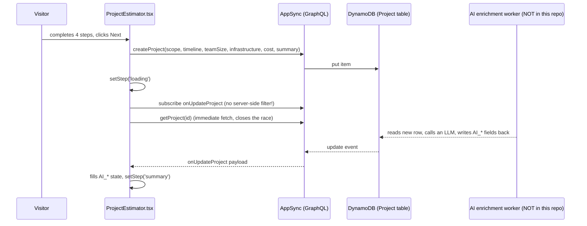

# HyperNova Inc — Application & Architecture Guide

> Audience: a developer joining this project who knows React/TypeScript but has never seen
> Plasmic, AWS Amplify Gen 1, or this repo. Read this end-to-end once; after that use it as a map.

---

## 1. What this application is

HyperNova Inc is a software consultancy. This repo is their **public marketing website** plus one
genuinely interactive product: an **AI Project Estimator**.

The site has two jobs:

1. **Tell the story** — services, technologies, case studies, insights (blog), "why US-based senior
   developers" landing pages. This content is designed and edited in a visual builder (Plasmic), not
   by writing JSX.
2. **Capture leads** — every page funnels toward two conversion points:
   - a **contact form** (name / email / phone / description), and
   - the **AI Project Estimator**, a multi-step wizard where a visitor describes a project and gets
     back an AI-generated cost range, timeline, team composition, infrastructure recommendation, risk
     assessment and a Gantt chart — then hands over their contact details to get it.

Everything else in the codebase — analytics, A/B testing, the 3D astronaut hero — exists to serve
those two jobs (convert more visitors, and measure which variants convert best).

**The mental model that matters most:** this is a *designer-driven site with a few developer-owned
islands of behavior*. ~95% of the UI is generated from a Plasmic design project. The developer-owned
logic lives in about six files. Find those six files and you understand the app.

The islands of real logic:

| File | Lines | What it does |
| --- | --- | --- |
| `components/ProjectEstimator.tsx` | ~1,475 | The estimator wizard: state machine, GraphQL writes, live AI result subscription/polling, CRM submit, analytics |
| `components/ThreeAstronaut.tsx` | ~1,481 | Three.js hero scene: GLB model load, animation mixer, responsive camera, loading/fade states |
| `pages/_app.tsx` | ~598 | App shell: Amplify config, all tracking script injection, UTM/tracking-id system, hero A/B assignment |
| `components/ContactForm.tsx` | ~434 | Contact form: validation/sanitization, GraphQL lead creation, toasts |
| `components/GanttChart.tsx` | ~240 | Renders AI-produced project phases as a timeline chart |
| `components/PlasmicExperimentTracking.tsx` | ~189 | Plasmic A/B split assignment + impression events into GTM |
| `pages/api/create-hubspot-lead.ts` | ~435 | Server-side HubSpot contact create/update with validation + rate limiting |

---

## 2. Stack at a glance

| Layer | Technology | Notes |
| --- | --- | --- |
| Framework | **Next.js 14.2.29, Pages Router** | Not the App Router. `pages/` is the routing source of truth. |
| Language | TypeScript 5.8, React 18 | `strict` is on (`tsconfig.json`), but generated Plasmic files opt out via `// @ts-nocheck`. |
| UI source | **Plasmic** (codegen scheme) | Designers publish in Plasmic Studio → CLI/CI writes React files into `components/plasmic/`. |
| Content | **Plasmic CMS** | Blog/"insights" rows fetched at runtime by `@plasmicpkgs/plasmic-cms` components. |
| Backend | **AWS Amplify Gen 1** → AppSync (GraphQL) + DynamoDB | Schema at `amplify/backend/api/hypernovainc/schema.graphql`. |
| Auth | Cognito **Identity Pool (guest/unauthenticated)** | A Cognito User Pool resource exists but no login UI uses it. |
| CRM | **HubSpot** Contacts API v3 | Called server-side only, from `pages/api/create-hubspot-lead.ts`. |
| Analytics | GTM → GA4, LinkedIn Insight, Meta Pixel, X/Twitter Pixel | All injected as inline scripts from `pages/_app.tsx`. |
| Experimentation | Plasmic Splits + one hand-rolled cookie experiment | See §8. |
| 3D | three.js 0.182 (`GLTFLoader`) | Hero astronaut, client-only via `next/dynamic`. |
| Hosting/CI | **AWS Amplify Hosting** (`main` → prod, `dev` → dev) | Plus a GitHub Action for Plasmic sync. |
| Tests | Jest 29 (one smoke-test file) | See §10 — this is the weakest part of the repo. |

---

## 3. Repository map

```
hypernova-inc-main/
├── pages/                     # Next.js Pages Router — routes + API routes
│   ├── _app.tsx               # ⭐ app shell: Amplify config, tracking, hero experiment
│   ├── index.tsx              # ⭐ homepage; wires the 3D astronaut into the Plasmic hero
│   ├── plasmic-host.tsx       # Plasmic Studio canvas host (used by designers, not visitors)
│   ├── api/
│   │   ├── create-hubspot-lead.ts   # ⭐ the only real API route
│   │   └── hubspot.ts               # dead stub — logs and returns ok, no real HubSpot call
│   ├── insights.tsx, insights/[slug].tsx
│   ├── technologies.tsx, technology/[slug].tsx
│   ├── case-study.tsx, case-studies/oso.tsx
│   ├── services.tsx, production-quality.tsx, senior-developers-proven-teams.tsx
│   ├── solutions/{usa-based-developers,convert-vibe-code-to-production-quality}.tsx
│   ├── tools/{ai-project-estimator,nova}.tsx
│   └── book-a-meeting.tsx
│
├── components/                # ✍️  YOU OWN THESE — hand-written wrappers around Plasmic components
│   ├── ProjectEstimator.tsx   # ⭐ the estimator wizard
│   ├── ContactForm.tsx        # ⭐ contact form logic
│   ├── ThreeAstronaut.tsx     # ⭐ three.js hero
│   ├── GanttChart.tsx         # pure-React chart, no Plasmic dependency
│   ├── PlasmicExperimentTracking.tsx  # A/B split provider + GTM impressions
│   ├── ...~65 thin wrappers   # Hero.tsx, Footer.tsx, Card.tsx… mostly 45-line pass-throughs
│   └── plasmic/               # 🚫 GENERATED — never edit
│       ├── hypernova_inc/     # 170 files: this project's design system + pages
│       └── antd_5_hostless/, react_aria/, react_slick/, lottie_react/, …  (Plasmic packages)
│
├── src/
│   ├── amplifyconfiguration.dev.json  / .main.json   # 🚫 generated by Amplify CLI
│   ├── API.ts                 # 🚫 generated TS types for the GraphQL schema
│   ├── graphql/               # 🚫 generated queries/mutations/subscriptions (.ts + .graphql)
│   └── utils/
│       ├── api-client.ts      # `generateClient()` — the shared AppSync client
│       └── env.ts             # resolves 'dev' | 'prod' at runtime
│
├── lib/                       # ✍️  server-side helpers (used only by API routes)
│   ├── inputValidation.ts     # field limits, email/phone validators, sanitizer
│   └── rateLimiter.ts         # in-memory IP rate limiter (5 req / 15 min)
│
├── amplify/                   # 🚫 Amplify CLI-managed backend IaC
│   ├── backend/api/hypernovainc/schema.graphql   # ⭐ the data model (worth reading)
│   ├── backend/auth/…         # Cognito user pool (unused by the frontend today)
│   └── team-provider-info.json  # env list: main, dev, jasondev, noahdev, tyler, contactfor
│
├── styles/globals.css         # global resets + astronaut experiment CSS gating
├── public/                    # favicon, Plasmic image assets, GLB model + textures
├── docs/                      # historical design notes (see fabledocs/README.md)
├── __tests__/ContactForm.test.ts   # the only test file
├── .env.development / .env.production  # ⚠️ committed, and contain a live HubSpot token (§12)
├── plasmic.json / plasmic.lock       # 🚫 Plasmic CLI bookkeeping
└── .github/workflows/plasmic.yml     # Plasmic → GitHub sync automation
```

Legend: ⭐ = read this first · ✍️ = developer-owned · 🚫 = generated, do not hand-edit.

---

## 4. The Plasmic model (read this before you edit any UI)

Plasmic is a visual builder. Designers build pages and components in Plasmic Studio; the Plasmic CLI
(or the GitHub Action) **generates React code into this repo**. This project uses the *codegen*
scheme, which produces two files per component:

```
components/plasmic/hypernova_inc/PlasmicContactForm.tsx   # 🚫 generated, regenerated on every sync
components/ContactForm.tsx                                # ✍️ yours, never overwritten
```

### The two rules

1. **Never edit anything under `components/plasmic/`.** Every file there starts with
   `// This code is auto-generated by Plasmic; please do not edit!` and carries `@ts-nocheck`. Your
   edits are destroyed the next time a designer publishes.
2. **All behavior goes in the wrapper.** The wrapper imports the generated component and passes it
   variants, slot contents and *overrides*.

### How a wrapper attaches behavior

Plasmic names nodes inside a design ("firstName", "submitButton", "hero"). The generated component
accepts a prop per named node. Three things you can pass:

```tsx
<PlasmicContactForm
  // 1) props for a named node — merged onto that element
  firstName={{ value, onChange: handleChange, onBlur: handleBlur, hasError: !!errors.firstName }}
  // 2) slot content — React children rendered into a designed hole
  errors={{ children: <>{errorItems}</> }}
  // 3) variants — activate a design state (here the wizard's current step)
  step={step}
/>
```

`components/ContactForm.tsx:370-427` is the canonical example of (1) and (2);
`components/ProjectEstimator.tsx:1278` shows a variant being driven by React state (`step={step}`);
`pages/index.tsx:79-155` shows the fourth mechanism, **`wrap`**, which lets you wrap a designed node
in your own JSX (used to inject the 3D astronaut stage around the designed hero).

### The sync workflow

- Designers publish in Plasmic Studio → `.github/workflows/plasmic.yml` receives a
  `repository_dispatch` event → runs the Plasmic action → commits regenerated files, opening a PR if
  it created a new branch.
- Locally you can pull the latest design with the Plasmic CLI (`@plasmicapp/cli` is a devDependency).
- `plasmic.json` maps every Plasmic component ID to a file path; `plasmic.lock` records checksums.
  Both are machine-managed — if you get a conflict in them, take the incoming version and re-sync.

### Global contexts

`components/plasmic/hypernova_inc/PlasmicGlobalContextsProvider.tsx` wraps every page and supplies:
Plasmic **CMS credentials** (database id + read token, currently hard-coded in the generated file),
an **Ant Design 5** theme, an **embedded CSS** block (`html { scroll-behavior: smooth }`) and a
**scroll-parallax** provider. Every page component in `pages/` opens with `<GlobalContextsProvider>`.

---

## 5. Routes and what lives on them

Every page file follows the same 37–41 line shape: wrap `GlobalContextsProvider` +
`PageParamsProvider__`, render the generated `Plasmic<PageName>` component. Only `index.tsx` deviates
(it injects the astronaut).

| Route | Page file | Notable |
| --- | --- | --- |
| `/` | `pages/index.tsx` | Hero A/B experiment, Three.js astronaut, image preloading |
| `/tools/ai-project-estimator` | `pages/tools/ai-project-estimator.tsx` | Renders the estimator |
| `/tools/nova` | `pages/tools/nova.tsx` | Secondary tool page |
| `/services`, `/technologies`, `/production-quality`, `/senior-developers-proven-teams` | matching files | Static marketing |
| `/solutions/usa-based-developers`, `/solutions/convert-vibe-code-to-production-quality` | `pages/solutions/*` | Campaign landing pages |
| `/case-study`, `/case-studies/oso` | `pages/case-study.tsx`, `pages/case-studies/oso.tsx` | Case studies |
| `/insights`, `/insights/[slug]` | `pages/insights*.tsx` | Blog. The detail page pulls rows from **Plasmic CMS** via `CmsQueryRepeater`/`CmsRowField`/`CmsRowImage` inside the generated component |
| `/technology/[slug]` | `pages/technology/[slug].tsx` | Technology detail pages |
| `/book-a-meeting` | `pages/book-a-meeting.tsx` | Currently a designed page with no scheduler integration |
| `/plasmic-host` | `pages/plasmic-host.tsx` | Plasmic Studio's canvas host — not a user-facing page |

**Rendering model:** no page exports `getStaticProps`, `getStaticPaths` or `getServerSideProps`.
Everything is statically generated at build time with no props, and all dynamic behavior (CMS
fetches, A/B assignment, estimator state) happens **client-side**. `next.config.mjs` sets
`trailingSlash: true` — which is why the estimator posts to `/api/create-hubspot-lead/` **with** a
trailing slash (`components/ProjectEstimator.tsx:929`); dropping it causes a redirect that can eat
the POST body.

Note the consequence for `[slug]` routes: because there is no `getStaticPaths`, slug pages are
resolved on the client from `useRouter().query` by the Plasmic CMS components. That is why insight
content flashes in after hydration rather than being in the HTML.

---

## 6. Feature deep-dive: the AI Project Estimator

This is the only stateful "app" in the repo. All of it is in `components/ProjectEstimator.tsx`.

### 6.1 The step machine

```
start ──▶ scope ──▶ timeline ──▶ team ──▶ infrastructure ──▶ loading ──▶ summary
             ▲         ▲           ▲            │                          │
             └─────────┴───────────┴────────────┘   (Back)                 │
                                     ▲──────────────────────────────────────┘ (Back / Restart)
```

- `step` is React state (`useState<StepType>`) that is passed straight into the Plasmic component as
  a **variant**, so the design switches screens: `components/ProjectEstimator.tsx:1278`.
- `handleNext` (`:766`) validates the current step then advances; on `infrastructure` it calls
  `handleProjectSubmit`.
- Each step can be skipped with a "Recommend for me" checkbox, tracked in the `autoSelections`
  state (`timeline | team | infrastructure`). When set, the corresponding field is submitted as the
  literal string `"Recommend for me"` and the AI is expected to fill it in.
- Team options are fixed keys: `1Developer`, `2Developers`, `2Developers1Designer`,
  `4Developers1Designer`. Infrastructure options: `staticVm`, `awsEphemeral`, `kubernetes`.

### 6.2 The baseline (non-AI) estimate

Before any AI response arrives, the UI shows a locally computed estimate so the summary is never
empty (`computeDefaultEstimate`, `:352`):

- Rates per hour: senior dev $150–200, mid dev $100–150, designer $100–150 (`ROLE_RATES`, `:187`).
- 160 hours per person per month; timeline parsed from free text by `parseTimelineToMonths` (`:196`),
  which understands "6 months", "2 years", "8 weeks", "90 days" and defaults to 12 months.
- Hours are presented as a ±15% range.

### 6.3 The AI round-trip



**Where the AI actually runs is not in this repository.** `amplify/backend/backend-config.json` has
`"function": {}` and there are no custom resolvers — so whatever populates the `AI_*` fields (a
DynamoDB-stream Lambda, a separate service, an n8n/Zapier-style workflow) is deployed and maintained
outside this repo. If you need to change prompts or model behavior, ask the team where that worker
lives; you will not find it by grepping here.

**Four overlapping mechanisms** fetch the AI result — worth knowing because they all fire:

| # | Mechanism | Code | Timing |
| --- | --- | --- | --- |
| 1 | AppSync subscription `onUpdateProject`, filtered **client-side** by id | `:514` | live |
| 2 | Immediate `getProject` right after subscribing | `:582` | once, ~instant |
| 3 | Fallback polling, 6 attempts × 5 s | `:629`, armed at `:752` | starts at T+15 s only if nothing arrived |
| 4 | "Refresher" poll on the summary screen, 1 s interval × 30 | `:1089` | while `step === 'summary'` and cost still missing |

If nothing ever arrives, mechanism 3 gives up after 6 attempts and shows the summary anyway with the
locally computed baseline (`:636`). There is no error state — see story **HN-06**.

### 6.4 Parsing AI output

The worker writes prose, not structured data, so the component does a lot of text mining:

- `extractPhasesJsonFromText` (`:124`) scans `AI_timelineValidation` for a `PHASES_JSON:{...}` marker
  and brace-matches the object out of the prose; `removePhasesJsonFromText` (`:151`) strips it before
  display.
- `extractCostSummary`, `extractTeamSummary`, `extractTeamCompositionDetails`,
  `extractInfrastructureSummary`, `extractTimelineSummary`, `getTimelineRangeInMonths` (`:212`–`:311`)
  are all regex/line heuristics over free text.
- The parsed phases feed `GanttChart` (`components/GanttChart.tsx`), which falls back to five default
  phases (Planning & Discovery / Design & Architecture / Development / Testing & QA / Deployment)
  scaled to the total duration if it can't parse anything.

This layer is brittle by construction. If a story asks you to change how a number is displayed, the
change is almost always in one of these extractors, not in the design.

### 6.5 The conversion step

On the summary screen the visitor fills name/email/phone/message and clicks "Get started"
(`handleContactSubmit`, `:878`):

1. Validates first/last/email client-side (email regex only).
2. Pushes `contact_form_submitted` to `dataLayer`.
3. Reads UTM + `tracking_id` out of `localStorage['hypernova_tracking']` — the same object
   `pages/_app.tsx` writes (§8).
4. `POST /api/create-hubspot-lead/` — **the primary system**. A non-OK response throws and shows an
   error toast.
5. Then `createLead` into DynamoDB as a **best-effort secondary** write; failures are only
   `console.warn`ed.

---

## 7. Feature deep-dive: lead capture

There are **two different lead paths that do not behave the same way**, which surprises everyone:

| | `components/ContactForm.tsx` | Estimator contact step |
| --- | --- | --- |
| Goes to HubSpot | ❌ no | ✅ yes |
| Writes `Lead` to DynamoDB | ✅ yes (primary) | ✅ yes (secondary, failures swallowed) |
| Server-side validation | ❌ browser only | ✅ `lib/inputValidation.ts` |
| Rate limited | ❌ | ✅ 5 / 15 min per IP |
| Phone required | ✅ | ❌ |

`ContactForm.tsx` calls `client.graphql({ query: createLead })` directly from the browser
(`:310`). Its validators are hand-rolled and *stricter than they look*: names accept letters and
hyphens only (no spaces, apostrophes or accented characters — `O'Brien` and `Anne Marie` are
rejected, `:132`), and the description field strips prompt-injection-looking tokens
(`system:`, `assistant:`, `[INST]`, `<|…|>`) as you type (`:90-107`).

### `pages/api/create-hubspot-lead.ts` — the server route

The one place with real server-side rigor:

1. `POST` only, else 405.
2. `checkRateLimit(req)` from `lib/rateLimiter.ts` — 5 requests / 15 minutes keyed on
   `x-forwarded-for` → `x-real-ip` → `cf-connecting-ip`; emits `X-RateLimit-*` and `Retry-After`.
3. Requires `HUBSPOT_API_KEY` in the environment.
4. Validates + sanitizes every field via `lib/inputValidation.ts` (length caps, email/phone regexes,
   control-character and angle-bracket stripping).
5. Maps to HubSpot properties, including environment tagging: a checkbox property
   `environment__dev` is set `true` for dev and `false` for prod (overridable with
   `HUBSPOT_ENV_DEV_PROPERTY_NAME` / `HUBSPOT_ENV_PROD_PROPERTY_NAME`).
6. `POST https://api.hubapi.com/crm/v3/objects/contacts`; on **409 duplicate** it searches by email
   and `PATCH`es the existing contact (`updateExistingContact`, `:339`).
7. Error details are only returned to the client outside production.

The property names it writes (`estimator_completed`, `tracking_id_uuid`, `utm_*`) are documented in
`HUBSPOT CONFIG.md`. Several estimator fields (scope, timeline, team size, estimated cost…) are
**commented out** at `:229-264` because the matching custom properties don't exist in the HubSpot
portal yet — that's a known gap, not dead code someone forgot.

`pages/api/hubspot.ts` is a **stub**: it validates an `env` field, `console.log`s, and returns ok.
Nothing calls it.

### Data model (`amplify/backend/api/hypernovainc/schema.graphql`)

```graphql
type Project  @model @auth(rules: [{ allow: public, provider: identityPool }]) { … AI_* fields … }
type Lead     @model @auth(rules: [{ allow: public, provider: identityPool }]) { email, firstName, … }
type LeadReceiver @model @auth(rules: [{ allow: public, provider: identityPool }]) { email @primaryKey, name }
```

`@model` makes Amplify generate a DynamoDB table + full CRUD resolvers + subscriptions.
`allow: public, provider: identityPool` means **any anonymous visitor with guest credentials can call
every generated operation**, including `listLeads` and `deleteProject`. See §12.

`LeadReceiver` has no code path in this repo — presumably the external worker reads it to decide who
gets notified.

---

## 8. Config, environments, analytics and experiments

### Environment resolution (three places, same logic)

| Where | Code |
| --- | --- |
| Amplify config choice at module load | `pages/_app.tsx:13-23` — picks `amplifyconfiguration.main.json` vs `.dev.json` |
| App-wide value for tracking | `pages/_app.tsx:40`, injected to `window.__NEXT_APP_ENV__` at `:215` |
| Client/server helper | `src/utils/env.ts` — reads the injected global on the client, `process.env` on the server |

Rule: `NEXT_PUBLIC_APP_ENV` wins; otherwise `NODE_ENV === 'development' → 'dev'`, else `'prod'`.
Amplify backend environments are listed in `amplify/team-provider-info.json`: `main` (prod), `dev`,
plus personal sandboxes `jasondev`, `noahdev`, `tyler`, `contactfor`.

### The tracking system (`pages/_app.tsx`)

Everything is injected as inline `<script>` in `<Head>`, in a deliberate order:

1. **Hero experiment assignment** (`:132`) — runs *before first paint* so there is no visible flicker.
   Reads/writes cookie `astronaut_variant` (`threejs` | `static`, 90 days, migrating the legacy
   `hn_astronaut_variant`), sets `document.documentElement[data-astronaut-variant]`, exposes
   `window.__ASTRONAUT_VARIANT__`, pushes the assignment to `dataLayer`, and mirrors the choice into
   the Plasmic split storage key so both experiment systems agree.
2. **UTM / tracking-id system** (`:236`) — defines `window.hypernovaTracking.trackPage()`. If the URL
   has any `utm_*` param it mints a new UUID-ish `tracking_id` and stores
   `localStorage['hypernova_tracking']` with a **30-minute** expiry; otherwise it reuses or refreshes
   the stored one. On load it seeds storage **without** emitting an event (to avoid duplicate GA4
   pageviews); `trackPage()` is called on every client-side `routeChangeComplete` (`:45-67`).
3. **GTM**, then **LinkedIn Insight**, **Meta Pixel**, **X Pixel** — each gated on its own
   `NEXT_PUBLIC_*` env var, each with a `<noscript>` fallback.

Set `NEXT_PUBLIC_ENABLE_GA4_LOCALHOST=true` in development to get `[tracking]`, `[GTM]` and `[LI]`
console diagnostics plus `window.__HN_TRACKING_DEBUG__`.

**Every custom event carries `env` and `app_env`** so GTM can route dev traffic to the dev GA4 stream.
Events currently emitted by the estimator: `estimator_started`, `estimator_progress` (steps 1–4),
`estimator_completed`, `contact_form_input`, `contact_form_submitted`.

### Two A/B systems

- **Plasmic Splits** — `components/PlasmicExperimentTracking.tsx`. Because no page provides
  `plasmicSplitKnownValues` via SSR, the `ClientSplitsProvider` branch always runs: it renders the
  control on the server, then applies the stored/random variant on the client after mount, and pushes
  a `plasmic_experiment_impression` event (deduped per path+variant) into `dataLayer`. Assignments
  persist in `localStorage['plasmic_split_known:<expKey>']`.
- **The astronaut experiment** — hand-rolled in `_app.tsx` (above) and rendered by
  `pages/index.tsx` + CSS gating in `styles/globals.css:141-148`. Both variants are always in the DOM;
  CSS hides the losing one. `ThreeAstronaut` is only mounted when the cookie says `threejs`.

---

## 9. The 3D hero, briefly

`components/ThreeAstronaut.tsx` is loaded with `next/dynamic({ ssr: false })` from
`pages/index.tsx:12`. It builds a `WebGLRenderer` with `alpha: true`, loads
`public/source/Walking astronaut.glb` through `GLTFLoader` with a `LoadingManager` that drives a
progress/fade state machine (`loading → fading → done`), sets up an `AnimationMixer` with three named
clips (float / moonWalk / wave), renders floating control buttons (styled in
`styles/globals.css:50-130`), and calls `onReady` so the page can flip `data-three-ready`.

`pages/index.tsx` also preloads the hero background images with `fetchPriority="high"` and merely
*prefetches* the GLB, deliberately letting the background image win the network race, and it renders
different stage geometry for mobile (`window.innerWidth <= 1024`, tracked with a resize listener).

---

## 10. Build, test, deploy

```bash
npm install
npm run dev        # next dev — http://localhost:3000
npm run build      # next build
npm run start      # serve the production build
npm run lint       # next lint && prettier --write .
npm test           # npx --yes jest@29.7.0 --passWithNoTests
```

**Local setup checklist for day 1**

1. `npm install` (this repo ships no `node_modules`; `package-lock.json` is committed — use `npm ci`
   if you want reproducibility).
2. Copy the env values you need into `.env.local` (**do not** add secrets to the committed
   `.env.development` / `.env.production` — see §12). At minimum you need `HUBSPOT_API_KEY` for the
   estimator's contact step to work; without it the route returns a 500.
3. `npm run dev`, then visit `/` and `/tools/ai-project-estimator`.
4. The estimator needs the dev AppSync backend to be reachable — `src/amplifyconfiguration.dev.json`
   is committed, so the GraphQL calls work out of the box, but the `AI_*` fields will only populate
   if the external enrichment worker is running against that same environment.

**Testing reality check.** `jest.config.js` sets `testEnvironment: 'node'` even though
`jest-environment-jsdom` and Testing Library are installed, so no component can actually render in a
test today. `jest.setup.js` hand-implements `toBeInTheDocument`/`toHaveValue`/`toBeDisabled` because
`@testing-library/jest-dom` "wouldn't install" at the time. `__tests__/ContactForm.test.ts` only
asserts that modules export things. `package.json` also declares
`test:e2e:comprehensive → node scripts/e2e-comprehensive.js`, and **`scripts/` does not exist**.

**Git hooks** (`.husky/`): `pre-commit` runs `npm run lint` and then `git add -A` — note that this
stages *everything* in your working tree, including files you deliberately left out of the commit.
`pre-push` runs a full `npm run build`.

**Deploy.** AWS Amplify Hosting builds each branch: `main` → prod backend, `dev` → dev backend,
feature branches share `dev` (see the root `README.md` for the team's branching workflow).
`next.config.mjs` sets `eslint.ignoreDuringBuilds: true`, so lint errors never block a deploy.

---

## 11. Conventions to follow

- **Formatting** (`.prettierrc`): no semicolons, single quotes, 2-space indent, 120 print width,
  JSX single quotes, trailing commas es5. Run `npm run lint` before committing (the hook does too).
- **Path alias**: `@/*` maps to the repo root (`tsconfig.json`), e.g. `@/styles/globals.css`.
  Existing files mix `@/…` and relative imports; prefer `@/` for cross-folder imports.
- **Adding behavior to a designed component**: create/extend the wrapper in `components/`, never the
  file in `components/plasmic/`. If the node you need isn't exposed, ask a designer to name it in
  Plasmic Studio.
- **Server-only code** goes in `lib/` and is imported only from `pages/api/`. Anything in
  `components/` or `src/utils/` ships to the browser.
- **Never commit secrets** — see §12. Runtime config that the browser needs must be prefixed
  `NEXT_PUBLIC_`; anything without that prefix stays server-side.
- **GraphQL is generated.** Change `amplify/backend/api/hypernovainc/schema.graphql`, then
  `amplify push` (or `amplify codegen`) to regenerate `src/API.ts` and `src/graphql/*`. Editing the
  generated files by hand will be reverted on the next codegen.
- **Analytics events**: always include `env` and `app_env` (`import { env } from '@/src/utils/env'`),
  and use `window.dataLayer?.push(...)` with the optional chain — `dataLayer` may not exist if GTM is
  unconfigured.

---

## 12. Known gaps, risks and rough edges

These are facts about the code as it stands today. Several map directly to stories in
[02-feature-backlog-user-stories.md](./02-feature-backlog-user-stories.md).

| # | Issue | Where | Why it matters |
| --- | --- | --- | --- |
| 1 | **A live HubSpot private-app token is committed** (`HUBSPOT_API_KEY=pat-na2-…`) and `.gitignore` only excludes `.env*.local`, so `.env.development` / `.env.production` are tracked | `.env.*` | Anyone with repo access has write access to the CRM. Rotate + move to Amplify env vars → **HN-12** |
| 2 | **All GraphQL models are publicly writable/readable** by unauthenticated identity-pool credentials | `schema.graphql:3,28,40` | An anonymous visitor can `listLeads` (PII) or `deleteProject`. → **HN-11** |
| 3 | **The estimator subscribes to *all* project updates** and filters by id in the browser | `ProjectEstimator.tsx:514` | Every concurrent visitor receives every other visitor's project scope/estimate over the socket. → **HN-10** |
| 4 | Rate limiter is a **per-process `Map` with a module-level `setInterval`** | `lib/rateLimiter.ts:11,14` | Useless across Lambda instances/containers; also keeps a timer alive per instance. → **HN-09** |
| 5 | Validation errors in the estimator use **`alert()`**; the contact form's error list isn't linked to inputs | `ProjectEstimator.tsx:466,762,774-795` | Poor UX, poor accessibility. → **HN-05** |
| 6 | **No error state when the AI never responds** — after 6 polls it shows the baseline summary silently | `ProjectEstimator.tsx:636` | User can't tell a real estimate from a fallback. → **HN-06** |
| 7 | Heavy **`console.log` debugging left in production** paths (form values, full form state, project payloads) | `ContactForm.tsx:53,75,102`, `ProjectEstimator.tsx` throughout | Leaks PII into browser consoles and noise into logs. → **HN-20** |
| 8 | **No `sitemap.xml`, `robots.txt`, canonical tags, or per-page `<title>`/description** — OG tags in `_app.tsx` are identical on every route | `pages/_app.tsx:197-213` | Every page shares one social card and one description. → **HN-15** |
| 9 | **No custom `404`/`500` pages**, no `_document.tsx` | `pages/` | Visitors hit the bare Next.js error page. → **HN-16** |
| 10 | **Tracking scripts load before any consent** | `pages/_app.tsx` | GDPR/ePrivacy exposure for EU traffic. → **HN-14** |
| 11 | **Two lead paths behave differently** (§7) — the contact form never reaches HubSpot | `ContactForm.tsx:310` | Leads from the main form are invisible to sales in the CRM. → **HN-07** |
| 12 | `pages/api/hubspot.ts` is a dead stub; `scripts/e2e-comprehensive.js` referenced by `package.json` doesn't exist | | Confusing for newcomers; the npm script fails. → **HN-19** |
| 13 | Test suite can't render components (`testEnvironment: 'node'`), one smoke file, hand-rolled matchers | `jest.config.js`, `jest.setup.js` | No safety net for the estimator's state machine. → **HN-19** |
| 14 | Text-mining of LLM prose (`PHASES_JSON:` marker, regex extractors) | `ProjectEstimator.tsx:124-311` | Any prompt change downstream silently breaks the summary UI |
| 15 | `isMobile` is computed from a resize listener after mount | `pages/index.tsx:28-35` | First paint always uses desktop geometry; causes a layout shift on phones |
| 16 | `eslint.ignoreDuringBuilds: true` | `next.config.mjs:4` | Lint regressions can't fail a deploy |

---

## 13. Glossary

| Term | Meaning here |
| --- | --- |
| **Plasmic** | Visual builder that generates the React UI in `components/plasmic/` |
| **Plasmic CMS** | Plasmic's hosted content database; powers `/insights` content |
| **Codegen scheme** | Plasmic mode where components are written into the repo as source (vs. loader/runtime fetch) |
| **Wrapper** | The hand-owned `components/Foo.tsx` that adds behavior to generated `PlasmicFoo` |
| **Variant** | A named design state (e.g. the estimator's `step`) toggled by a prop |
| **Slot** | A designed hole you fill with React children |
| **Amplify Gen 1** | The older Amplify CLI (`amplify push`, `amplify env`) — not Amplify Gen 2 |
| **AppSync** | AWS managed GraphQL service backing `@model` types with DynamoDB |
| **Identity pool (guest)** | Cognito credentials handed to anonymous visitors; the app's only auth |
| **`AI_*` fields** | Columns on `Project` written by an enrichment worker that lives outside this repo |
| **`tracking_id`** | Client-generated UUID stored in `localStorage` for 30 minutes, joined to HubSpot as `tracking_id_uuid` |
